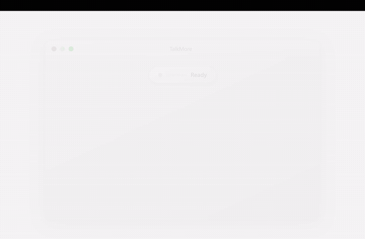
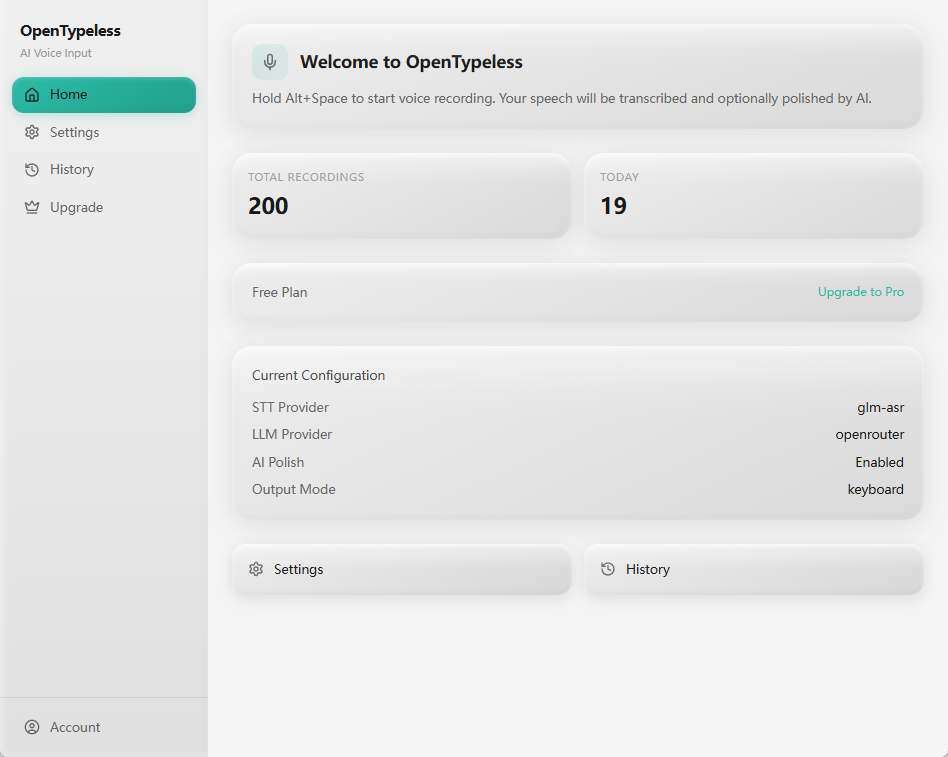
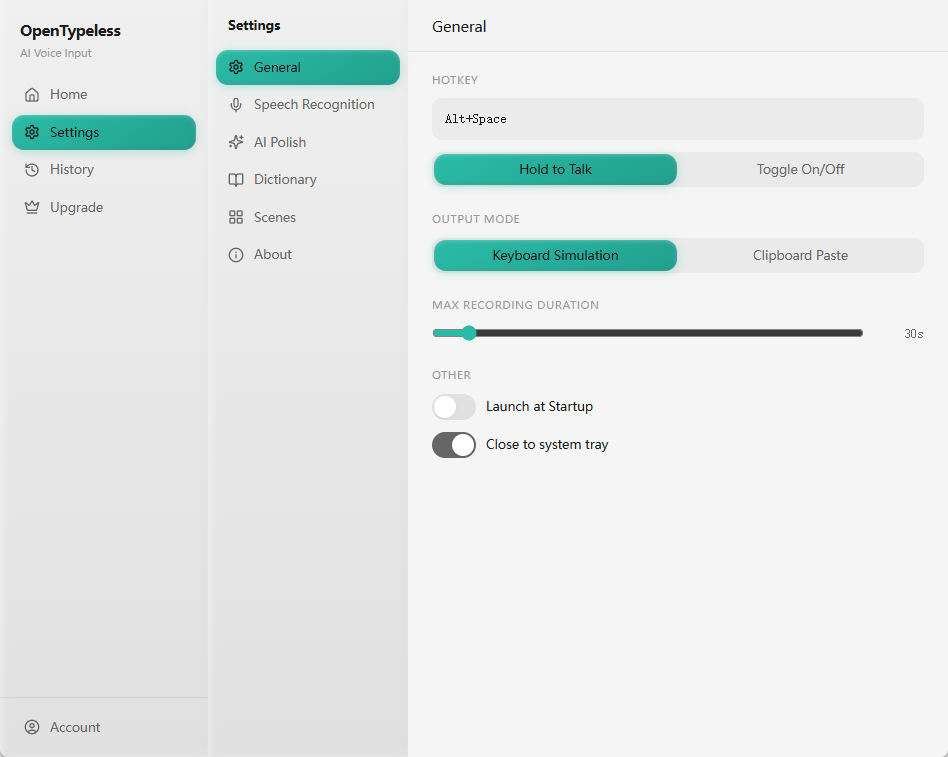
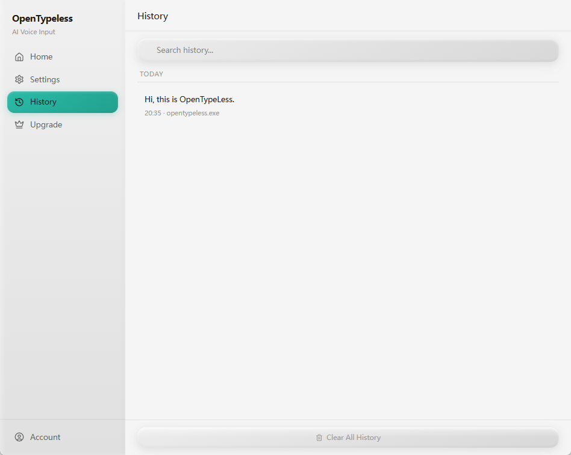

# VoiceSlate

Local-first desktop voice input with BYOK speech recognition, AI polish, and reliable Windows output.

[](LICENSE)
[](https://github.com/wanghaoxiang6/VoiceSlate/actions/workflows/ci.yml)
[](https://github.com/wanghaoxiang6/VoiceSlate/releases)



VoiceSlate captures speech, sends audio to your chosen STT provider, optionally polishes the transcript with an LLM, and pastes the final text back into the active app. This fork focuses on a practical local-first workflow instead of a hosted subscription-first setup.

VoiceSlate is based on [OpenTypeless](https://github.com/tover0314-w/opentypeless). Attribution and license details are kept in [NOTICE](NOTICE) and [LICENSE](LICENSE).

## Highlights

- BYOK-first setup for STT and LLM providers
- Volcengine STT integration with fast and higher-accuracy modes
- DeepSeek-friendly default polish setup
- Windows-focused hotkey, capsule, focus, and output fixes
- Local correction history
- Usage stats and monthly API cost estimates
- Clipboard-based output path that works well across desktop apps

## Current Workflow

1. Trigger the hotkey.
2. Record speech.
3. Send audio to STT.
4. Optionally polish the transcript with an LLM.
5. Paste the result back into the active app.
6. Save history and local usage stats.

Default local-friendly settings:

- `STT`: `volcengine-flash`
- `LLM`: `deepseek`
- `Hotkey`: `Right Alt`
- `Fallback hotkey`: `F8`
- `Output mode`: `clipboard`

## Screenshots



| Settings | History |
|---|---|
|  |  |

## Development

```bash
npm install
npm run test
npm run build
npm run tauri build
```

## Release Notes

- First public release notes: [docs/releases/v0.1.0.md](docs/releases/v0.1.0.md)
- Changelog: [CHANGELOG.md](CHANGELOG.md)

## Repository Notes

- Core local docs: [README_LOCAL_RELEASE.md](README_LOCAL_RELEASE.md)
- Chinese handoff notes: [docs/HANDOFF_LOCAL_EDITION_zh.md](docs/HANDOFF_LOCAL_EDITION_zh.md)
- Default public-safe cloud base URL is `https://example.invalid`
- `Right Alt` may still vary across Windows setups, so `F8` remains the stable fallback

## Security And Privacy

- Do not commit API keys, local settings, databases, or credential-bearing logs
- This fork is intended to be usable without a hosted VoiceSlate backend
- See [SECURITY.md](SECURITY.md) for project-level guidance

## License

MIT. See [LICENSE](LICENSE).
